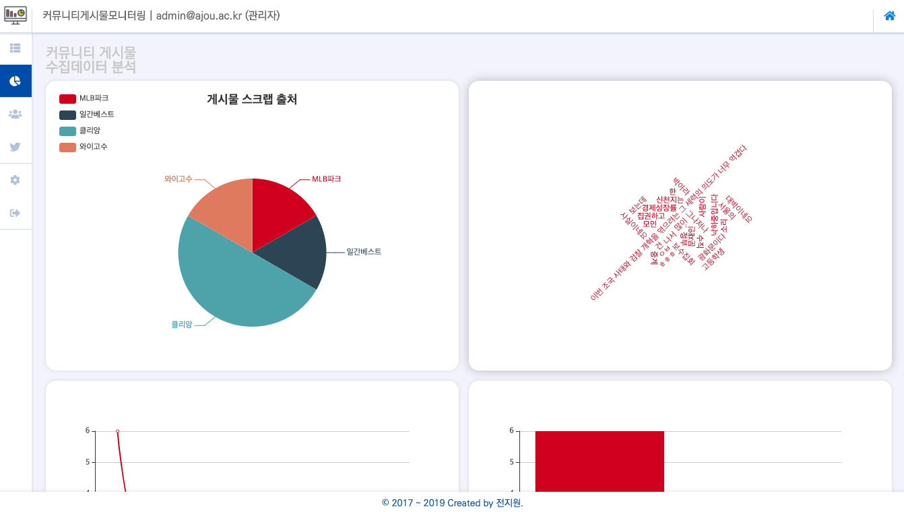

# 커뮤니티게시물모니터링포털

Community Monitoring Works Portal (V2)

> 국내 유명 인터넷 커뮤니티 게시물 통합 수집 및 특이 게시물 보관, 보고서 변환, 데이터 분석 시각화 기능 제공
>
> ### Prerequisites
>
> - Express - Back-end
> - Nuxt.js (Vue.js SSR) - Front-end
> - MongoDB - Data Storage
>   - localhost:27017/cmwp

[Fig 1] Login Page (PC)

[Fig 2] 커뮤니티 게시물 스크랩

[Fig 2-1] 커뮤니티 게시물 스크랩 저장

[Fig 2-2] SNS 게시물 스크랩

[Fig 2-3] 스크랩 게시물 리스트

[Fig 2-4] PDF 보고서

[Fig 2-5] 스크린샷 미리보기

> **위 스크린샷 안의 모든 내용은 단순 서비스 소개를 위한 테스트 데이터로, 제작자의 정치적 성향 등과는 일체 무관함을 알려드립니다.**

각종 유명 인터넷 커뮤니티 사이트에서의 게시물을 크롤링하여 한 곳에 모아 키워드별로 조회할 수 있고, 특이사항이 있는 게시물을 통합보관하여 분석할 수 있도록 PDF 문서 변환 및 데이터 분석 시각화 기능을 제공합니다.

[Fig 3] 수집된 데이터 시각화

사이버 특기의경 복무시 수사업무보조를 위해 작성한 프로그램의 수정된 버전입니다. 공개되지 못하는 부분에 대해 삭제하여 새롭게 만든 버전입니다.

> 모바일 화면에서도 편하게 사용할 수 있도록 반응형 웹을 지원하고 있습니다.

[Fig 4] 모바일에서의 로그인 화면

[Fig 5] 승인 대기 화면

[Fig 6] 사용자 관리 화면

> #### History
>
> 최초 개발 시작
>
> - 2017년 12월 ~ 2018년 10월
> - 프로토타입 : Ruby on Rails
>
> 개발 완료 및 도입
>
> - 2018년 11월
> - Vue.js SSR Framework인 Nuxt.js 기반으로 개발 (Server: Express.js, DB: Elasticsearch, Visualization & Log Management: Kibana)
>
> 공개 버전 수정
>
> - 2019년 05월 ~ 09월
> - DB: MongoDB로 변경